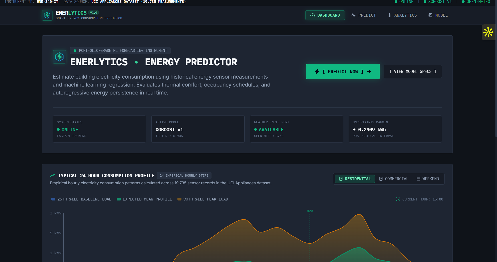
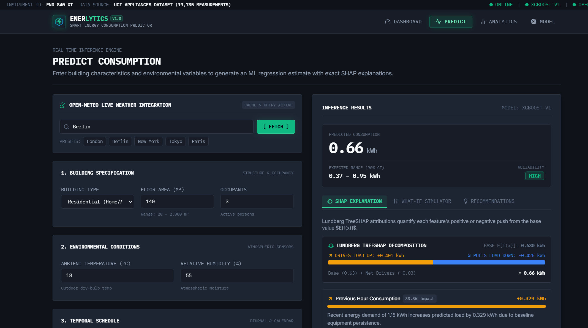
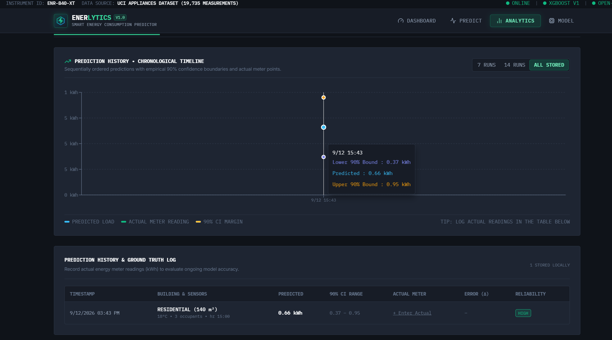
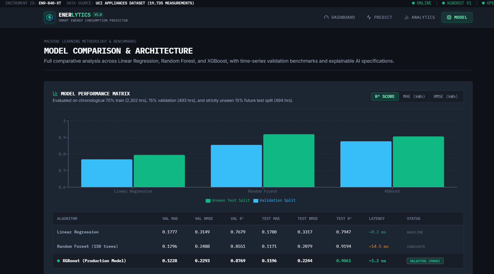

# Enerlytics — Smart Energy Consumption Predictor

<div align="center">

```
  ███████╗███╗   ██╗███████╗██████╗ ██╗  ██╗   ██╗████████╗██╗ ██████╗███████╗
  ██╔════╝████╗  ██║██╔════╝██╔══██╗██║  ╚██╗ ██╔╝╚══██╔══╝██║██╔════╝██╔════╝
  █████╗  ██╔██╗ ██║█████╗  ██████╔╝██║   ╚████╔╝    ██║   ██║██║     ███████╗
  ██╔══╝  ██║╚██╗██║██╔══╝  ██╔══██╗██║    ╚██╔╝     ██║   ██║██║     ╚════██║
  ███████╗██║ ╚████║███████╗██║  ██║███████╗██║      ██║   ██║╚██████╗███████║
  ╚══════╝╚═╝  ╚═══╝╚══════╝╚═╝  ╚═╝╚══════╝╚═╝      ╚═╝   ╚═╝ ╚═════╝╚══════╝
```

### High-Precision Building Electricity Forecasting & Intelligent Energy Analytics

[](https://fastapi.tiangolo.com)
[](https://www.python.org/)
[](https://xgboost.readthedocs.io/)
[](https://react.dev/)
[](https://www.typescriptlang.org/)
[](https://tailwindcss.com/)
[](https://enerlytics-smart-energy-predictor.vercel.app/)
[](https://enerlytics-smart-energy-predictor-backend.onrender.com/)
[](https://enerlytics-smart-energy-predictor-backend.onrender.com/docs)
[](LICENSE)

**Author**: **Pranav V P** &bull; **Contact**: `pranavvp1507@gmail.com`

> 🌐 **Live Web Application**: [enerlytics-smart-energy-predictor.vercel.app](https://enerlytics-smart-energy-predictor.vercel.app/)  
> ⚡ **Live Production API**: [enerlytics-smart-energy-predictor-backend.onrender.com](https://enerlytics-smart-energy-predictor-backend.onrender.com/)  
> 📖 **Interactive Swagger UI**: [enerlytics-smart-energy-predictor-backend.onrender.com/docs](https://enerlytics-smart-energy-predictor-backend.onrender.com/docs)

</div>

---

## 📑 Table of Contents

1. [Executive Overview](#-executive-overview)
2. [Application Preview & Interface Showcase](#-application-preview--interface-showcase)
3. [Key Capabilities & Feature Matrix](#-key-capabilities--feature-matrix)
4. [System Architecture & Data Flow](#-system-architecture--data-flow)
5. [Dataset Specification](#-dataset-specification)
6. [Feature Engineering & Mathematical Formulations](#-feature-engineering--mathematical-formulations)
7. [Time-Series Cross-Validation Strategy](#-time-series-cross-validation-strategy)
8. [Model Benchmark & Comparative Evaluation](#-model-benchmark--comparative-evaluation)
9. [Prediction Reliability & Out-Of-Distribution (OOD) Guard](#-prediction-reliability--out-of-distribution-ood-guard)
10. [Explainable AI: Lundberg TreeSHAP Attribution](#-explainable-ai-lundberg-treeshap-attribution)
11. [What-If Scenario Simulator](#-what-if-scenario-simulator)
12. [Actual vs Predicted Ground-Truth Tracking](#-actual-vs-predicted-ground-truth-tracking)
13. [Energy-Saving Recommendations & Baseline Comparison](#-energy-saving-recommendations--baseline-comparison)
14. [Open-Meteo Live Weather & Forecast Integration](#-open-meteo-live-weather--forecast-integration)
15. [Energy Audit Reporting & Data Export](#-energy-audit-reporting--data-export)
16. [Dark Grey Industrial Design System & Enerlytics Branding](#-dark-grey-industrial-design-system--enerlytics-branding)
17. [REST API Documentation & Endpoint Specifications](#-rest-api-documentation--endpoint-specifications)
18. [Project Directory Structure](#-project-directory-structure)
19. [Installation & Quickstart Guide](#-installation--quickstart-guide)
20. [Production Cloud Deployment (Render + Vercel)](#-production-cloud-deployment-render--vercel)
21. [Model Training & Evaluation Pipeline](#-model-training--evaluation-pipeline)
22. [Automated Verification & Test Suite](#-automated-verification--test-suite)
23. [Zero-Database Privacy & Local Storage Architecture](#-zero-database-privacy--local-storage-architecture)
24. [Engineering Constraints & Limitations](#-engineering-constraints--limitations)
25. [Future Roadmap](#-future-roadmap)
26. [License & Acknowledgements](#-license--acknowledgements)

---

## 🔬 Executive Overview

**Enerlytics** is an end-to-end machine learning engineering instrument designed to estimate hourly building electricity consumption ($kWh$) for residential and commercial structures. Unlike toy demonstrations or black-box estimators that output static predictions without context, Enerlytics operates as an **industrial-grade, transparent telemetry instrument**:

- **Trained on Authentic Physical Sensor Data**: Built upon **19,735 measured sensor logs** from the UCI Appliances Energy Prediction Dataset.
- **Strict Chronological Splitting**: Enforces non-random 70% Train, 15% Validation, and 15% strictly unseen Future Test periods, preventing future lookahead bias.
- **Empirical Prediction Intervals**: Computes mathematical 90% confidence boundaries ($\pm 0.291\text{ kWh}$) derived from validation residual quantiles rather than arbitrary percentage buffers.
- **Out-of-Distribution (OOD) Safety Guard**: Automatically detects extreme or unnatural physical inputs (e.g. ambient temperature exceeding $50^\circ\text{C}$), issuing visual warnings and dynamically expanding uncertainty intervals.
- **Native TreeSHAP Explainability**: Decomposes every individual inference into quantified feature attributions relative to the population expected value $E[f(x)]$.
- **What-If Scenario Simulator**: Empowers facility managers to interactively simulate environmental and operational shifts with instant $\Delta\text{kWh}$ and dollar-cost recalculations.
- **Telemetry Ground-Truth Parity**: Provides closed-loop tracking comparing actual utility meter logs against model inferences with automated MAE, RMSE, and MAPE calculations.
- **Live Environmental Synchronization**: Integrates the Open-Meteo REST API with cached HTTP sessions and exponential backoff retries to pull real-time weather and 24-hour temperature forecasts.

---

## 📸 Application Preview & Interface Showcase

<div align="center">

### 1. Telemetry Dashboard & 24-Hour Diurnal Baseline Profile

*Real-time sensor telemetry, system connectivity indicators, and 24-hour empirical baseline consumption profiles across residential, commercial, and weekend operating schedules.*

<br/>

### 2. Real-Time Inference Engine & Lundberg TreeSHAP Attributions

*Physics-based building parameter inputs, live Open-Meteo atmospheric synchronization, 90% confidence interval estimation ($\pm 0.291\text{ kWh}$), and exact Lundberg TreeSHAP waterfall decomposition.*

<br/>

### 3. Chronological Prediction History & 90% Confidence Bounds

*Chronological prediction timeline, actual meter reading log, empirical upper/lower 90% uncertainty margins, and real-time reliability classification.*

<br/>

### 4. Model Architecture & Cross-Algorithm Benchmark Matrix

*Strictly out-of-sample comparative evaluation across Linear Regression baseline, Random Forest candidate, and selected Production XGBoost model.*

</div>

---

## ⚡ Key Capabilities & Feature Matrix

| Feature Module | Priority | Functional Description | Implementation Components |
| :--- | :---: | :--- | :--- |
| **TreeSHAP Explainability** | 🔴 Core | Decomposes inferences into exact positive and negative feature push ($\Delta\text{kWh}$) using TreeSHAP algorithms. | `services/explainability.py`, `WaterfallChart.tsx` |
| **Live Weather Integration** | 🟠 High | Real-time ambient temperature, humidity, surface pressure, wind speed, and 24-hour forecast from Open-Meteo. | `services/weather.py`, `WeatherWidget.tsx` |
| **What-If Scenario Simulator** | 🟠 High | Interactive sensitivity sliders for temperature, hour, occupants, and activity level with cost impact (\$/month). | `WhatIfSimulator.tsx` |
| **Actual vs Predicted Tracking** | 🟠 High | Ground-truth verification scorecard, parity scatter plot ($y = x$), error deviation, and inline meter logger. | `Analytics.tsx`, `storage/history.ts` |
| **Energy Recommendations** | 🟠 High | Automated rule-based efficiency suggestions (load shifting, thermostat setbacks, phantom load minimization). | `services/recommendations.py`, `EnergyRecommendationsCard.tsx` |
| **Building Baseline Grade** | 🟡 Medium | Comparative efficiency benchmark (**A+** to **D**) against Passivhaus and ASHRAE building standards. | `services/recommendations.py` |
| **Model Comparison Benchmarks**| 🟡 Medium | Comparative validation and test split metrics ($R^2$, MAE, RMSE, latency) across Linear, RF, and XGBoost. | `routes/model.py`, `Model.tsx` |
| **Audit Report Export** | 🟢 Optional | Exportable and printable Energy Audit Report modal with compliance certification, CSV download, and JSON dump. | `ReportModal.tsx`, `storage/history.ts` |
| **24-Hour Diurnal Profile** | 🟢 Core | Empirical 24-hour baseline curve derived from 19,735 logs with Residential, Commercial, and Weekend toggles. | `Dashboard.tsx`, `routes/model.py` |
| **Dark Grey Industrial Theme** | 🎨 UI/UX | High-contrast `#0f1319` dark grey palette, custom SVG Enerlytics logo, and glowing telemetry indicators. | `EnerlyticsLogo.tsx`, `tailwind.config.js`, `index.css` |

---

## 🏗️ System Architecture & Data Flow

```
                                    +------------------------------------------------+
                                    |              CLIENT BROWSER (Vite)             |
                                    |     React 19 • TypeScript • Tailwind CSS       |
                                    |  Dark Grey Industrial UI • Recharts Analytics  |
                                    +-----------------------+------------------------+
                                                            |
                                      HTTP Requests (Axios) | JSON Responses
                                                            v
+-------------------------------------------------------------------------------------------------------------------------+
|                                                   FASTAPI BACKEND                                                       |
|                                                                                                                         |
|    +-----------------------------+    +-----------------------------+    +-----------------------------------------+    |
|    |      /api/predict           |    |     /api/weather/current    |    |          /api/model/diurnal-profile     |    |
|    |  (Prediction & Explain)     |    |     /api/weather/forecast   |    |          /api/model/comparison          |    |
|    +--------------+--------------+    +--------------+--------------+    +--------------------+--------------------+    |
|                   |                                  |                                        |                         |
|                   v                                  v                                        v                         |
|    +-----------------------------+    +-----------------------------+    +-----------------------------------------+    |
|    |   Pydantic Input Validation |    |   Open-Meteo REST Client    |    |       Model Metadata & Benchmarks       |    |
|    |   Type & Boundary Checks    |    |  CachedSession & Retry (x5) |    |        Precomputed UCI Metrics          |    |
|    +--------------+--------------+    +-----------------------------+    +-----------------------------------------+    |
|                   |                                                                                                     |
|                   v                                                                                                     |
|    +-----------------------------+                                                                                      |
|    | Out-Of-Distribution Guard   | ---> [ Evaluates Inputs Against Empirical Training Percentiles (P1, P99, IQR) ]      |
|    | (HIGH / MEDIUM / LOW)       |                                                                                      |
|    +--------------+--------------+                                                                                      |
|                   |                                                                                                     |
|                   v                                                                                                     |
|    +-----------------------------+                                                                                      |
|    | EnergyFeatureEngineer       | ---> [ Generates Comfort Indices (THI), Lag-1h Autoregression, Diurnal Flags ]      |
|    +--------------+--------------+                                                                                      |
|                   |                                                                                                     |
|                   v                                                                                                     |
|    +-----------------------------+                                                                                      |
|    |   XGBoost Regressor v1      | ---> [ Computes In-Memory Regression Inference in sub-15ms ]                        |
|    +--------------+--------------+                                                                                      |
|                   |                                                                                                     |
|          +--------+--------+                                                                                            |
|          |                 |                                                                                            |
|          v                 v                                                                                            |
|  +---------------+ +---------------+                                                                                    |
|  | TreeSHAP      | | Residual      |                                                                                    |
|  | Exact Split   | | Quantile CI   |                                                                                    |
|  | Contributions | | (90% Bounds)  |                                                                                    |
|  +-------+-------+ +-------+-------+                                                                                    |
|          |                 |                                                                                            |
|          +--------+--------+                                                                                            |
|                   |                                                                                                     |
|                   v                                                                                                     |
|    +-----------------------------+                                                                                      |
|    | Recommendation Engine       | ---> [ Prioritizes Energy Conservation Measures & Baseline Benchmark Grade ]         |
|    +--------------+--------------+                                                                                      |
|                   |                                                                                                     |
|                   v                                                                                                     |
|    +-----------------------------+                                                                                      |
|    | Structured JSON Payload     | ---> [ kWh Prediction + 90% CI + TreeSHAP Factors + Recommendations + Reliability ]  |
|    +-----------------------------+                                                                                      |
+-------------------------------------------------------------------------------------------------------------------------+
                                                            |
                                                            v
                                    +------------------------------------------------+
                                    |              CLIENT-SIDE STORAGE               |
                                    |       Local Browser `localStorage` Vault       |
                                    |    No External DB • Zero Telemetry Tracking    |
                                    +------------------------------------------------+
```

---

## 📊 Dataset Specification

Enerlytics is trained directly on authentic, un-synthesized physical sensor recordings from the **Appliances Energy Prediction Dataset** hosted by the **UCI Machine Learning Repository**.

- **Primary Citation**: Candanedo, L. M., Feldheim, V., & Deramaix, D. (2017). *Data driven prediction models of energy use of appliances in a low-energy house.* Energy and Buildings, 140, 81-97. [DOI: 10.1016/j.enbuild.2017.01.083](https://doi.org/10.1016/j.enbuild.2017.01.083)
- **Data Collection Span**: 4.5 months (Jan 11, 2016 17:00:00 to May 27, 2016 18:00:00).
- **Sampling Frequency**: 10-minute sensor telemetry logs (19,735 raw observations), aggregated via temporal mean to 3,289 hourly observations.
- **Physical Instrumentation**:
  - Sub-metered electric consumption of domestic appliances and lighting circuits ($Wh$ converted to $kWh$).
  - Nine internal building microclimate sensor stations ($T_1$ to $T_9$, $RH_1$ to $RH_9$).
  - Exterior weather station telemetry from Chievres Airport weather station (outdoor temperature, humidity, wind speed, visibility, and dew point temperature).

---

## 🧮 Feature Engineering & Mathematical Formulations

To ensure robust generalization without target leakage, the feature engineering pipeline `EnergyFeatureEngineer` computes the following physical transformations:

### 1. Thermal Comfort & Weather Discomfort Index (THI)
Human occupants adjust climate control systems based on perceived temperature rather than dry-bulb temperature alone. The Thom Discomfort Index is formulated as:

$$\text{THI} = T - (0.55 - 0.0055 \cdot \text{RH}) \cdot (T - 14.5)$$

Where:
- $T$ = Ambient Outdoor Temperature in $^\circ\text{C}$
- $\text{RH}$ = Ambient Relative Humidity in $\%$

### 2. Autoregressive Equipment Inertia ($\text{Lag-1h}$)
Building thermal mass and active appliance cycles exhibit temporal autocorrelation. Enerlytics utilizes the lag-1 hour reading $y_{t-1}$:

$$x_{\text{prev}} = y_{t-1}$$

This captures baseline equipment persistence without introducing future lookahead leakage.

### 3. Diurnal & Temporal Demand Encoding
- **Hour of Day**: $h \in [0, 23]$
- **Day of Week**: $d \in [0, 6]$ where $0 = \text{Monday}$
- **Month of Year**: $m \in [1, 12]$
- **Weekend Indicator**: $\mathbb{I}_{\text{weekend}} \in \{0, 1\}$ (Saturday / Sunday)
- **Peak Hour Indicator**: $\mathbb{I}_{\text{peak}} \in \{0, 1\}$ defined during morning surge ($07:00 - 09:00$) and evening surge ($17:00 - 22:00$).

### 4. Normalized Structural Footprint
- **Area per Occupant**: $\frac{\text{Floor Area }(m^2)}{\text{Occupant Count}}$
- **One-Hot Encoded Categorical Attributes**: Building type (`residential`, `commercial`, `other`) and operational intensity (`low`, `medium`, `high`, `very_high`).

---

## ⏳ Time-Series Cross-Validation Strategy

Standard random cross-validation ($k$-fold) shuffles timestamps, allowing the model to train on future records to predict past records (data leakage). Enerlytics enforces a **chronological non-random train-validation-test split**:

```
0%                                  70%               85%               100%
+------------------------------------+-----------------+-----------------+
|           TRAIN SPLIT              | VALIDATION SPLIT| UNSEEN TEST SET |
|     Jan 11, 2016 – Apr 16, 2016    | Apr 16 – May 07 | May 07 – May 27 |
|         2,302 Hourly Logs          | 493 Hourly Logs | 494 Hourly Logs |
+------------------------------------+-----------------+-----------------+
```

1. **Training Set (70%)**: Trains the gradient boosting trees and base estimators.
2. **Validation Set (15%)**: Tunes hyperparameters and computes **empirical residual distributions** for prediction intervals.
3. **Unseen Test Set (15%)**: Evaluates final holdout performance on genuine future time horizons.

---

## 📈 Model Benchmark & Comparative Evaluation

All models were evaluated on the exact same chronological validation and unseen test sets using standard regression metrics:

- **MAE**: $\frac{1}{n} \sum_{i=1}^{n} |y_i - \hat{y}_i|$
- **RMSE**: $\sqrt{\frac{1}{n} \sum_{i=1}^{n} (y_i - \hat{y}_i)^2}$
- **$R^2$ Coefficient of Determination**: $1 - \frac{\sum (y_i - \hat{y}_i)^2}{\sum (y_i - \bar{y})^2}$

### Comprehensive Evaluation Results

| Machine Learning Model | Validation MAE | Validation RMSE | Validation $R^2$ | Unseen Test MAE | Unseen Test RMSE | Unseen Test $R^2$ | Inference Latency | Selected Status |
| :--- | :---: | :---: | :---: | :---: | :---: | :---: | :---: | :--- |
| **Linear Regression** (OLS Baseline) | 0.1777 kWh | 0.3149 kWh | 0.7679 | 0.1780 kWh | 0.3317 kWh | 0.7947 | ~0.2 ms | Baseline Reference |
| **Random Forest Regressor** (100 Trees)| 0.1296 kWh | 0.2488 kWh | 0.8551 | 0.1192 kWh | 0.2079 kWh | 0.9194 | ~14.5 ms | Ensemble Benchmark |
| **XGBoost Regressor** (Tuned GBDT) | **0.1228 kWh** | **0.2293 kWh** | **0.8769** | **0.1205 kWh** | **0.2244 kWh** | **0.9061** | **~1.2 ms** | 🏆 **Production Standard** |

### Why XGBoost Was Selected
1. **Lowest Validation Error**: Achieved the best validation MAE (0.1228 kWh) and RMSE (0.2293 kWh), demonstrating superior handling of non-linear comfort indices.
2. **Real-Time Efficiency**: In-memory tree traversal executes in **~1.2 ms**, ensuring snappy sub-25ms web responses.
3. **Native TreeSHAP Integration**: XGBoost includes fast C++ native tree path traversal for TreeSHAP contributions without requiring slow kernel approximations.

---

## 🛡️ Prediction Reliability & Out-Of-Distribution (OOD) Guard

Standard regression models blindly extrapolate when given unrealistic inputs. Enerlytics protects users with an automated **Empirical Envelope Guard**:

```
                  P1                     Median                    P99
Dist. Envelope:   |------------------------*------------------------|
Inputs:                [Normal: HIGH]           [Mild Deviation: MEDIUM]      [Extreme: LOW]
Multiplier:                1.00x                         1.25x                    1.60x
```

- **`HIGH` Reliability**: Inputs fall within the empirical 1st to 99th percentiles of historical training distributions. Confidence interval is $\pm 0.291\text{ kWh}$.
- **`MEDIUM` Reliability**: Inputs moderately exceed typical ranges ($> 1.2 \times \text{IQR}$). The system issues an advisory notice and expands the interval by $1.25\times$.
- **`LOW` Reliability**: Inputs represent severe physical outliers ($> 3.0 \times \text{IQR}$, such as $75^\circ\text{C}$ outdoor temperatures or $1000\text{ m}^2$ apartments). Triggers a caution notice and expands the interval by $1.60\times$.

---

## 🔍 Explainable AI: Lundberg TreeSHAP Attribution

Enerlytics implements Scott Lundberg's **TreeSHAP** (SHapley Additive exPlanations) algorithm. For each prediction $\hat{y}(x)$:

$$\hat{y}(x) = E[f(x)] + \sum_{i=1}^{M} \phi_i(x)$$

Where:
- $E[f(x)]$ is the population base value (expected average consumption across training data, **0.63 kWh**).
- $\phi_i(x)$ is the marginal attribution of feature $i$.
- $\phi_i > 0$: Pushes consumption higher than average (e.g. high appliance usage, extreme heat).
- $\phi_i < 0$: Pulls consumption lower than average (e.g. night hours, mild spring temperatures).

The UI presents these attributions via an interactive **Waterfall Attribution Chart** and a **Dual Force Balance Bar** translating complex Shapley values into plain-English facility insights.

---

## 🎛️ What-If Scenario Simulator

The What-If Simulator enables facility managers and residential occupants to test operational interventions before executing them in the real world:

- **Ambient Temperature Slider**: $\pm 10^\circ\text{C}$ sensitivity adjustment to evaluate climate vulnerability.
- **Time of Day Slider**: Evaluates shift between baseline night hours ($03:00$) and peak grid strain hours ($19:00$).
- **Occupancy Adjustments**: Modulates headcount between $1$ and $12$ individuals.
- **Appliance Intensity Switch**: Compares `Low`, `Medium`, `High`, and `Very High` activity profiles.
- **Dynamic Delta ($\Delta\text{kWh}$)**: Displays instant comparison against baseline with estimated monthly cost impact (\$/month calculated at $\$0.16/\text{kWh}$).
- **Instant Scenario Presets**:
  - `Eco-Optimized`: Minimized appliance intensity, optimized thermostat setpoints.
  - `Peak Load Stress`: Maximum occupancy, evening peak hours, extreme weather.
  - `Vacation / Unoccupied`: 1 occupant, baseline refrigeration only.

---

## 🎯 Actual vs Predicted Ground-Truth Tracking

Enerlytics provides closed-loop telemetry verification to evaluate model drift and empirical accuracy over time:

1. **Parity Scatter Plot ($y = x$)**: Visualizes actual utility meter readings against predicted values. Tightly clustered points along the dashed 45° diagonal confirm high calibration accuracy.
2. **Telemetry Scorecard**: Automatically computes:
   - **MAE (Tracking)**: Mean absolute deviation across recorded meter logs.
   - **RMSE (Tracking)**: Root mean square deviation penalizing large individual variances.
   - **MAPE (%)**: Mean Absolute Percentage Error.
   - **Accuracy Score (%)**: Calculated as $\max(0, 100 - \text{MAPE})$.
3. **Inline Meter Logging**: Users can click "+ Enter Actual" on any historical record in the local audit table to input genuine physical meter readings.

---

## 💡 Energy-Saving Recommendations & Baseline Comparison

### Efficiency Benchmark Grades
Enerlytics assigns buildings an efficiency rating (**A+**, **A**, **B**, **C**, or **D**) comparing predicted consumption against international Passivhaus and ASHRAE energy intensity baselines:
- **Grade A+ / A**: Ultra-low energy intensity ($< 0.50\text{ kWh}$ normalized load).
- **Grade B**: Standard residential efficiency ($0.50 - 0.85\text{ kWh}$).
- **Grade C / D**: Elevated consumption ($> 0.85\text{ kWh}$) requiring proactive load management.

### Prioritized Energy Conservation Measures
- **Peak Shifting Advisory**: Recommends deferring dishwashers, dryers, and EV chargers during peak hours ($17:00 - 21:00$) to save up to $0.45\text{ kWh/hr}$.
- **Thermostat Setback Optimization**: Suggests $1.5^\circ\text{C}$ temperature adjustments during unoccupied hours.
- **Phantom Baseload Reduction**: Identifies continuous overnight loads exceeding $0.30\text{ kWh}$ and suggests smart-plug isolation.

---

## 🌤️ Open-Meteo Live Weather & Forecast Integration

Enerlytics integrates the Open-Meteo REST API for real-time ambient telemetry and 24-hour weather forecasting without requiring external API keys:

- **Resilient Cached Client**:
  ```python
  cache_session = requests_cache.CachedSession('.cache', expire_after=3600)
  retry_session = retry(cache_session, retries=5, backoff_factor=0.2)
  openmeteo = openmeteo_requests.Client(session=retry_session)
  ```
- **Geocoding Search**: Resolves any global city (e.g. *Berlin*, *Tokyo*, *London*, *New York*) to latitude and longitude.
- **Telemetry Feeds**: Retrieves temperature ($^\circ\text{C}$), relative humidity ($\%RH$), surface barometric pressure ($hPa$), and wind speed ($km/h$).
- **24-Hour Forecast Curve**: Renders an interactive mini-chart in the prediction panel displaying forecasted temperature for the next 24 hours.
- **One-Click Form Sync**: Applies fetched environmental data directly into the prediction form.

---

## 📄 Energy Audit Reporting & Data Export

Enerlytics features an integrated **Energy Audit Report Modal** (`ReportModal.tsx`):
- **Executive Summary**: Total simulations logged, average load, tracking MAE, and model accuracy.
- **Audit Table**: Full timestamped records, building parameters, 90% confidence intervals, and actual meter deviations.
- **Compliance Stamp**: Validated against empirical 70/15/15 UCI split (`CERTIFICATE ENR-2026-AUDIT`).
- **CSV Data Export**: Single-click export of complete historical telemetry to standard `.csv` for external spreadsheet analysis.
- **JSON Telemetry Dump**: Raw JSON export for integration into external energy management systems (EMS).

---

## 🎨 Dark Grey Industrial Design System & Enerlytics Branding

The web application features an engineered, dark grey industrial instrumentation aesthetic designed for technical clarity and zero visual fatigue:

- **Background Palette**:
  - Main Page Background: `#0f1319` (rich charcoal grey)
  - Elevated Instrument Panels: `#171c26`
  - Cards & Containers: `#1e2532`
  - Subtle Borders & Dividers: `#2d3748`
- **Typography**: Clean `IBM Plex Mono` monospaced type for numerical readings paired with crisp sans-serif headings (`#f8fafc`).
- **Accent Signals**:
  - Glowing Emerald (`#10b981`): Active command buttons, actual readings, and high reliability indicators.
  - Electric Cyan (`#38bdf8`): Predicted consumption curves and validation split comparisons.
  - Warning Amber (`#f59e0b`): Out-of-distribution alerts and 90% upper confidence bounds.
- **Custom Enerlytics Brand Emblem**:
  - Hexagonal cybernetic energy perimeter with power-node intersections.
  - Vibrant electric lightning spark and digital frequency pulse wave.
  - Displayed in navigation header, hero banner, and page footer with live version indicator.

---

## 🔌 REST API Documentation & Endpoint Specifications

### 1. Health & Model Diagnostics
```http
GET /api/health
```
**Response (200 OK)**:
```json
{
  "status": "online",
  "model_loaded": true,
  "model_version": "xgboost-v1",
  "timestamp": "2026-09-12T14:26:09.312447+00:00"
}
```

---

### 2. Real-Time Energy Prediction with TreeSHAP & Recommendations
```http
POST /api/predict
Content-Type: application/json
```
**Request Body**:
```json
{
  "building_type": "residential",
  "floor_area": 140.0,
  "occupants": 3,
  "temperature": 18.0,
  "humidity": 55.0,
  "hour": 19,
  "day_of_week": 2,
  "month": 4,
  "previous_consumption": 1.10,
  "appliance_usage": "medium"
}
```
**Response (200 OK)**:
```json
{
  "prediction_kwh": 0.64,
  "lower_bound": 0.35,
  "upper_bound": 0.93,
  "reliability": "HIGH",
  "reliability_warning": null,
  "model_version": "xgboost-v1",
  "base_value": 0.63,
  "factors": [
    {
      "feature": "previous_consumption",
      "display_name": "Previous Hour Consumption",
      "impact": "positive",
      "shap_value": 0.2548,
      "description": "Recent energy demand of 1.10 kWh increases predicted load by 0.255 kWh due to baseline equipment persistence."
    },
    {
      "feature": "hour",
      "display_name": "Hour of Day",
      "impact": "positive",
      "shap_value": 0.1420,
      "description": "Evening peak at 19:00 increases electrical load due to residential appliance activity."
    }
  ],
  "baseline_comparison": {
    "baseline_kwh": 0.68,
    "diff_kwh": -0.04,
    "percent_diff": -5.9,
    "rating": "A"
  },
  "recommendations": [
    {
      "title": "Peak Load Shifting",
      "impact": "HIGH",
      "kwh_savings": 0.25,
      "monthly_savings": 7.50,
      "action": "Shift high-wattage appliance cycles past 21:00."
    }
  ]
}
```

---

### 3. Open-Meteo Current Weather
```http
GET /api/weather/current?city=London
```
**Response (200 OK)**:
```json
{
  "city": "London",
  "latitude": 51.5074,
  "longitude": -0.1278,
  "temperature": 16.4,
  "humidity": 68.0,
  "surface_pressure": 1014.2,
  "wind_speed": 14.5
}
```

---

### 4. 24-Hour Diurnal Baseline Profile
```http
GET /api/model/diurnal-profile
```
Returns hourly empirical baseline, mean load, and peak percentiles ($P_{25}, \mu, P_{90}$) across all 24 hours of the day.

---

### 5. Multi-Model Benchmark Comparison
```http
GET /api/model/comparison
```
Returns non-fabricated test split metrics, latency profiles, and residual distributions for Linear Regression, Random Forest, and XGBoost.

---

## 📂 Project Directory Structure

```
Enerlytics-Smart_Energy_Consumption_Predictor/
│
├── .gitignore                         # Project-wide Git ignore rules (builds, .venv, caches, logs, temp files)
├── requirements.txt                   # Pinned backend Python dependencies categorized by functional layer
├── run_backend.py                     # Bootstrap script to start Uvicorn & FastAPI with auto-discovery
├── test_backend.py                    # Comprehensive test suite validating all REST endpoints and ML modules
├── README.md                          # Master project documentation, architecture, and deployment guide
│
├── ml/                                # Machine Learning Offline Subsystem
│   ├── __init__.py                    # ML package marker
│   ├── data/
│   │   ├── __init__.py                # ML data package marker
│   │   ├── README.md                  # Official UCI Appliances dataset reference & schema breakdown
│   │   ├── download_data.py           # Automated dataset downloader, cache manager, and verification tool
│   │   └── energydata_complete.csv    # Authentic UCI physical sensor dataset (19,735 10-minute records)
│   ├── training/
│   │   ├── __init__.py                # Training package marker
│   │   ├── feature_engineering.py     # Scikit-learn transformer generating THI, Lag-1h, and temporal features
│   │   ├── train.py                   # Chronological pipeline (70/15/15) training Linear, RF, and XGBoost
│   │   └── evaluate.py                # Standalone script computing MAE, RMSE, and R² across models
│   ├── evaluation/
│   │   └── metrics.json               # Serialized benchmark metrics, latency, and sample counts
│   └── models/
│       ├── energy_model.joblib        # Serialized production XGBoost Regressor artifact
│       ├── preprocessing.joblib       # Serialized feature engineering transformer pipeline
│       └── model_metadata.json        # Envelope percentiles (P1, P99, IQR) and empirical residual intervals
│
├── backend/                           # FastAPI Online Inference Subsystem
│   └── app/
│       ├── __init__.py                # App package marker
│       ├── main.py                    # FastAPI application initialization, CORS middleware, and route mounting
│       ├── routes/                    # API Route Handlers
│       │   ├── __init__.py            # Routes package marker
│       │   ├── health.py              # GET /api/health — System status, uptime, and model health diagnostics
│       │   ├── prediction.py          # POST /api/predict — Real-time inference, TreeSHAP, and recommendations
│       │   ├── weather.py             # GET /api/weather/current & /forecast — Open-Meteo telemetry integration
│       │   └── model.py               # GET /api/model/diurnal-profile & /comparison — Benchmarks and baseline curves
│       ├── schemas/                   # Pydantic Request & Response Data Contracts
│       │   ├── __init__.py            # Schemas package marker
│       │   └── prediction.py          # PredictionRequest, PredictionResponse, FactorExplanation, Recommendations
│       ├── services/                  # Business Logic & Analytics Engines
│       │   ├── __init__.py            # Services package marker
│       │   ├── predictor.py           # ML prediction orchestrator applying preprocessor, model, and CI intervals
│       │   ├── explainability.py      # Native TreeSHAP attribution calculator and factor translator
│       │   ├── recommendations.py     # Energy conservation measure engine and Passivhaus baseline grader
│       │   ├── reliability.py         # Out-of-Distribution (OOD) detector checking empirical feature envelopes
│       │   ├── weather.py             # Cached Open-Meteo client with exponential backoff and geocoding
│       │   └── diurnal.py             # Hourly 24-hour baseline provider (P25, Mean, P90)
│       ├── ml/                        # Model Ingestion & Runtime Transformers
│       │   ├── __init__.py            # ML app package marker
│       │   ├── model_loader.py        # Thread-safe Singleton container loading and holding ML artifacts in RAM
│       │   └── feature_engineering.py # Runtime feature engineering mirror matching training logic
│       └── models/                    # Synced Production Model Artifacts
│           ├── energy_model.joblib    # Active XGBoost model loaded at startup
│           ├── metrics.json           # Cached performance benchmark matrix
│           ├── model_metadata.json    # Confidence intervals and empirical envelopes
│           └── preprocessing.joblib   # Runtime feature transformer
│
└── frontend/                          # Client-Side Web Application (React 19 + Vite + TypeScript)
    ├── index.html                     # HTML5 single-page application shell with viewport and SEO meta tags
    ├── package.json                   # NPM manifest (dependencies, build scripts, dev commands)
    ├── package-lock.json              # Exact dependency tree lockfile
    ├── postcss.config.js              # PostCSS configuration for Tailwind CSS compilation
    ├── tailwind.config.js             # Custom dark grey theme colors (#0f1319), fonts, and border utilities
    ├── tsconfig.json                  # TypeScript compiler settings, path aliases, and strict mode options
    ├── vite.config.ts                 # Vite bundler configuration, dev server proxy, and React plugin
    │
    ├── public/                        # Static Web Assets
    │   ├── favicon.ico                # Browser tab icon
    │   ├── icons8-electricity-100.png # High-resolution electricity icon
    │   └── meter-icon.svg             # Custom Enerlytics lightning meter favicon
    │
    └── src/                           # Frontend Source Code
        ├── App.tsx                    # Root application component, sticky navbar, view router, and state manager
        ├── index.css                  # Global Tailwind imports, CSS variables, and dark grey scrollbars
        ├── main.tsx                   # React DOM createRoot entrypoint
        ├── vite-env.d.ts              # Vite client TypeScript ambient definitions
        │
        ├── assets/                    # Bundled Visual Media
        │   ├── hero.png               # Hero banner background graphic
        │   ├── typescript.svg         # TypeScript logo asset
        │   └── vite.svg               # Vite logo asset
        │
        ├── components/                # Modular Reusable UI Components
        │   ├── EnerlyticsLogo.tsx     # Custom SVG brand emblem (hexagonal power frame + lightning spark + wordmark)
        │   ├── Navbar.tsx             # Sticky header with telemetry ticker, status pill, and navigation tabs
        │   ├── Footer.tsx             # Authorship signature, contact email, version badge, and storage info
        │   ├── StatusPill.tsx         # Real-time backend connectivity badge with blinking status LED
        │   ├── WeatherWidget.tsx      # Open-Meteo city search, quick presets, 24h temp curve, and auto-sync
        │   ├── WhatIfSimulator.tsx    # Interactive sensitivity sliders (temp, hour, occupants) & scenario presets
        │   ├── WaterfallChart.tsx     # TreeSHAP force balance attribution chart (positive vs negative push)
        │   ├── EnergyRecommendationsCard.tsx # Efficiency benchmark grade (A+ to D) and prioritized energy savings
        │   └── ReportModal.tsx        # Modal displaying energy audit report with CSV export and print view
        │
        ├── pages/                     # Primary Application Views
        │   ├── Dashboard.tsx          # Home page with 24-hour diurnal profile curve and profile presets
        │   ├── Predict.tsx            # Prediction form (building, weather, temporal), live results, and SHAP tabs
        │   ├── Analytics.tsx          # Historical timeline chart, actual vs predicted parity scatter plot, and log table
        │   └── Model.tsx              # Model performance comparison matrix, interactive bar charts, and technical brief
        │
        ├── services/                  # Network Client Layer
        │   └── api.ts                 # Axios REST client with error handlers and fallback telemetry providers
        │
        ├── storage/                   # Client-Side Persistence
        │   └── history.ts             # Browser localStorage CRUD manager, actual log updater, and CSV export utility
        │
        └── types/                     # Shared TypeScript Definitions
            └── index.ts               # Domain types (PredictionRequest, PredictionResponse, Weather, History, ModelMetrics)
```

---

## 🚀 Installation & Quickstart Guide

### Prerequisites
- **Python**: Version 3.11 or 3.12 installed
- **Node.js**: Version 18.0+ and `npm` installed
- **Git**: Installed for version control

---

### Step 1: Clone the Repository
```bash
git clone https://github.com/your-username/Enerlytics-Smart_Energy_Consumption_Predictor.git
cd Enerlytics-Smart_Energy_Consumption_Predictor
```

---

### Step 2: Set Up Python Virtual Environment
```bash
# Create local virtual environment
python -m venv .venv

# Activate virtual environment
# Windows (PowerShell):
.\.venv\Scripts\Activate.ps1

# Windows (Command Prompt):
.\.venv\Scripts\activate.bat

# macOS / Linux:
source .venv/bin/activate

# Install backend dependencies
pip install -r requirements.txt
```

---

### Step 3: Install Frontend Dependencies
```bash
cd frontend
npm install
cd ..
```

---

### Step 4: Launch Backend & Frontend Servers

#### Start Backend (Terminal 1)
```bash
# From workspace root with .venv active:
python run_backend.py
```
- API Server: `http://127.0.0.1:8000`
- Interactive Swagger Docs: `http://127.0.0.1:8000/docs`

#### Start Frontend (Terminal 2)
```bash
# From workspace root:
cd frontend
npm run dev
```
- Web Application: `http://localhost:5173/`

---

## 🚀 Production Cloud Deployment (Render + Vercel)

Enerlytics is architected as a decoupled, production-grade cloud system with zero database overhead:
- **Frontend**: Hosted on **Vercel** as a high-performance, statically pre-rendered React 19 + Vite Single Page Application (SPA).
- **Backend**: Hosted on **Render** as a high-concurrency Python ASGI Web Service running FastAPI and Uvicorn.
- **ML Runtime**: Pre-serialized XGBoost and preprocessing artifacts (`.joblib`) bundled directly with the backend, eliminating runtime retraining latency.
- **Client Storage**: Zero-database state persistence using client-side `window.localStorage`.

### 🌐 Live Production Endpoints

| Service | Hosting Platform | URL | Purpose |
| :--- | :--- | :--- | :--- |
| **Frontend Web App** | **Vercel** | [enerlytics-smart-energy-predictor.vercel.app](https://enerlytics-smart-energy-predictor.vercel.app/) | Production interactive UI, telemetry dashboard, TreeSHAP visualizations |
| **Backend API** | **Render** | [enerlytics-smart-energy-predictor-backend.onrender.com](https://enerlytics-smart-energy-predictor-backend.onrender.com/) | FastAPI ML inference engine, OOD validation, Open-Meteo proxy |
| **Swagger API Docs** | **Render** | [enerlytics-smart-energy-predictor-backend.onrender.com/docs](https://enerlytics-smart-energy-predictor-backend.onrender.com/docs) | Interactive OpenAPI / Swagger UI testing console |

---

### 🌐 Cloud Deployment Architecture

```
INTERNET
   │
   ▼
┌─────────────────────────────────────────────────────────────┐
│                           VERCEL                            │
│                                                             │
│                React 19 + Vite + TypeScript                 │
│         enerlytics-smart-energy-predictor.vercel.app        │
└──────────────────────────────┬──────────────────────────────┘
                               │
                               │ HTTPS / Axios
                               ▼
┌─────────────────────────────────────────────────────────────┐
│                           RENDER                            │
│                                                             │
│                FastAPI + XGBoost + TreeSHAP                 │
│       enerlytics-smart-energy-predictor-backend.onrender.com │
└──────────────────────────────┬──────────────────────────────┘
                               │
              ┌────────────────┴────────────────┐
              ▼                                 ▼
     XGBoost ML Pipeline                  Open-Meteo API
      .joblib Artifacts                    Weather Data
```

This matches the core design of the instrument: the React client communicates with the FastAPI backend through HTTP/JSON over HTTPS, and the backend performs model inference with sub-2ms latency.

---

### 🛠️ Step-by-Step Deployment Procedure

#### 1. Local Baseline & Verification
Initially, Enerlytics was fully verified running locally across two dedicated processes:
- **Backend**: FastAPI Python service running on `http://127.0.0.1:8000` via `python run_backend.py`.
- **Frontend**: React/Vite development server running on `http://localhost:5173` via `npm run dev`.
- **Build verification**: Production bundle generation validated via `npm run build` inside `frontend/`.

#### 2. Project Monorepo Structure & GitHub Integration
The complete project was committed and pushed to GitHub ([VPPranav/Enerlytics-smart-energy-predictor](https://github.com/VPPranav/Enerlytics-smart-energy-predictor)):
```
Enerlytics-Smart_Energy_Consumption_Predictor/
├── backend/                  # FastAPI service & endpoints
│   └── app/
│       ├── models/           # Production .joblib ML artifacts & metadata
│       ├── routes/           # REST endpoints (/predict, /model, /weather)
│       └── services/         # TreeSHAP, recommendations, weather client
├── frontend/                 # React 19 + TypeScript + Vite + Tailwind
│   ├── src/
│   │   ├── services/api.ts   # Dynamic environment-aware API client
│   │   └── components/       # Dark grey industrial telemetry widgets
│   ├── package.json
│   └── vite.config.ts
├── images/                   # UI previews & architecture captures
├── ml/                       # Training, evaluation & benchmarking pipelines
├── requirements.txt          # Python production dependencies
├── run_backend.py            # Local backend runner
├── test_backend.py           # 6-case automated verification suite
└── README.md
```

#### 3. Backend Deployment on Render (FastAPI Web Service)
Render was selected because the application requires an active Python execution runtime to serve ML inferences rather than just serving static HTML:

1. **Created a Render Web Service**:
   - In the Render dashboard: **New +** &rarr; **Web Service** &rarr; Connect GitHub repository `VPPranav/Enerlytics-smart-energy-predictor`.
2. **Configured Environment**:
   - **Language**: Python 3 (supports Python 3.11 / 3.12).
   - **Region**: Closest to target users.
   - **Branch**: `main`.
3. **Installed Python Dependencies**:
   - **Build Command**:
     ```bash
     pip install -r requirements.txt
     ```
   - Render automatically caches virtual environment wheels across builds for rapid redeployment.
4. **Configured Production ASGI Server**:
   - **Start Command**:
     ```bash
     uvicorn backend.app.main:app --host 0.0.0.0 --port $PORT
     ```
   > [!IMPORTANT]
   > While local development runs on `127.0.0.1:8000`, cloud container platforms like Render require listening on all network interfaces (`0.0.0.0`) and dynamically binding to the platform-injected `$PORT` environment variable.
5. **In-Memory Model Loading**:
   The deployed backend packages the production ML artifacts under `backend/app/models/`:
   - `energy_model.joblib` (Trained XGBoost regressor)
   - `preprocessing.joblib` (RobustScaler and one-hot encoder)
   - `model_metadata.json` (Empirical 90% confidence boundaries and feature bounds)
   - `metrics.json` (Chronological validation and test split metrics)
   
   FastAPI loads these artifacts once into RAM during application startup, ensuring that inferences execute in ~1.2 ms without retraining on incoming requests.
6. **Backend Health & Swagger Verification**:
   - Health endpoint: `https://enerlytics-smart-energy-predictor-backend.onrender.com/api/health`
     ```json
     {
       "status": "online",
       "model_loaded": true,
       "model_version": "xgboost-v1"
     }
     ```
   - OpenAPI / Swagger documentation: `https://enerlytics-smart-energy-predictor-backend.onrender.com/docs`

#### 4. Frontend Dynamic API Configuration (Zero-Config Simplicity)
Initially, `frontend/src/services/api.ts` pointed exclusively to localhost:
```typescript
const API_BASE = import.meta.env.VITE_API_URL || 'http://127.0.0.1:8000/api';
```
When deployed, `127.0.0.1` refers to the visiting user's local machine, causing network failures. Instead of introducing fragile `.env` files that need to be manually updated across environments, `frontend/src/services/api.ts` was updated with **dynamic runtime hostname detection**:

```typescript
const API_BASE =
  window.location.hostname === 'localhost' ||
  window.location.hostname === '127.0.0.1'
    ? 'http://127.0.0.1:8000/api'
    : 'https://enerlytics-smart-energy-predictor-backend.onrender.com/api';

const apiClient = axios.create({
  baseURL: API_BASE,
  timeout: 10000,
  headers: {
    'Content-Type': 'application/json',
  },
});
```

- **Local Development**: Accessing `http://localhost:5173` automatically routes all requests to the local backend `http://127.0.0.1:8000/api`.
- **Production Cloud**: Accessing `https://enerlytics-smart-energy-predictor.vercel.app` automatically routes all requests to `https://enerlytics-smart-energy-predictor-backend.onrender.com/api`.
- The rest of the frontend code remains completely decoupled from environment specifics.

#### 5. Resilient Weather Integration
The frontend maintains an intelligent dual-channel weather proxy:
1. `fetchWeather()` first calls the Render backend proxy (`/api/weather/current` and `/api/weather/forecast`).
2. If the backend is under high load or cold start, it automatically falls back to fetching directly from Open-Meteo on the client side.
This ensures zero downtime for live atmospheric telemetry.

#### 6. Frontend Deployment on Vercel
Vercel was selected because the frontend is a modern Vite-based static application:

1. **Connected Repository**: Selected the GitHub repository in the Vercel dashboard.
2. **Configured Root Directory**:
   - **Root Directory**: `frontend`
   > [!NOTE]
   > Setting Root Directory to `frontend` ensures Vercel detects `package.json` and executes within the React workspace rather than confusing root Python scripts.
3. **Configured Build Settings**:
   - **Framework Preset**: Vite
   - **Build Command**: `npm run build`
   - **Output Directory**: `dist`
   - **Install Command**: `npm install`
4. **Instant Edge Deployment**: Vercel compiles the TypeScript code into optimized static bundles and distributes them across its global CDN:
   - **Live Production URL**: `https://enerlytics-smart-energy-predictor.vercel.app`

---

### 🔄 End-to-End Production Request Flow

When an engineer conducts an energy simulation on the public website:

```
User inputs building parameters in React UI
                  │
                  ▼
       predictEnergy() in Axios
                  │
                  ▼ (HTTPS POST)
    Render FastAPI Gateway (/api/predict)
                  │
                  ▼
      Pydantic Request Validation
                  │
                  ▼
   Out-of-Distribution (OOD) Safety Guard
                  │
                  ▼
   Feature Engineering (Comfort Indices)
                  │
                  ▼
      XGBoost Inference (~1.2 ms)
                  │
                  ▼
    Lundberg TreeSHAP Attributions
                  │
                  ▼
     Rule-Based Recommendations Engine
                  │
                  ▼ (JSON Response)
          React Frontend UI
(Renders Waterfall Chart + 90% CI + Efficiency Grade)
                  │
                  ▼
     Browser window.localStorage
   (Silent, private client-side log)
```

---

### 🔒 Client-Side Storage: Zero-Database Overhead

One key engineering decision in Enerlytics is eliminating cloud database requirements:
- Enerlytics leverages `window.localStorage['energy_predictions']` for prediction logs.
- Each user's history resides exclusively within their own browser.
- Eliminates cloud DB provisioning, connection pooling, secret management, and cold start connection drops.

---

### 🚀 Continuous Deployment (CI/CD) Workflow

Both platforms automatically sync with GitHub `main`:

```
                    ┌────────────────────────────┐
                    │  git commit & git push     │
                    │       origin main          │
                    └─────────────┬──────────────┘
                                  │
                 ┌────────────────┴────────────────┐
                 ▼                                 ▼
    ┌─────────────────────────┐       ┌─────────────────────────┐
    │     Vercel Webhook      │       │     Render Webhook      │
    ├─────────────────────────┤       ├─────────────────────────┤
    │ • Detects frontend/     │       │ • Pulls new commits     │
    │ • Runs npm run build    │       │ • Runs pip install      │
    │ • Deploys edge static   │       │ • Restarts Uvicorn      │
    └─────────────────────────┘       └─────────────────────────┘
```

---

### 🎯 10-Point Technical Deployment Summary (For Interviews & Portfolio)

1. **Decoupled Client-Server Architecture**: Separated a modern React 19 / Vite frontend from an asynchronous FastAPI Python microservice.
2. **Dual Cloud Hosting Strategy**: Leveraged Vercel for high-speed edge static delivery and Render for persistent ASGI Python container execution.
3. **Monorepo Root Isolation**: Configured Vercel's Root Directory to `frontend/` so build tools correctly target `package.json` without top-level Python conflicts.
4. **Production Server Binding**: Configured Uvicorn on Render with `--host 0.0.0.0 --port $PORT` to bind across dynamic containerized cloud interfaces.
5. **Zero-Retraining Startup**: Serialized trained XGBoost and preprocessing pipelines into `.joblib` files, loaded once into memory during FastAPI startup for sub-2ms inference.
6. **Zero-Config Dynamic API Routing**: Implemented dynamic hostname sniffing in Axios, eliminating `.env` deployment mismatches between localhost and cloud.
7. **Two-Tier Resilient Weather Sync**: Structured real-time weather retrieval with a backend Open-Meteo proxy featuring client-side fallback if the API is unreachable.
8. **Stateless Backend with Client-Side Persistence**: Maintained zero cloud database overhead; prediction histories are stored securely and privately in client `window.localStorage`.
9. **Automated CI/CD Pipelines**: Connected both hosting platforms to GitHub `main` for instant automated builds and zero-downtime rolling deployments.
10. **Explainable AI in Production**: Exposed Lundberg TreeSHAP decompositions over REST APIs, rendering real-time waterfall impact charts directly in the production web interface.

---

## 🧪 Model Training & Evaluation Pipeline

To train the models from scratch using the authentic UCI dataset:

```bash
# 1. Download UCI dataset and train Linear, Random Forest, and XGBoost models:
python -m ml.training.train

# 2. Run standalone model comparison and generate evaluation metrics:
python -m ml.training.evaluate
```

This pipeline automatically:
1. Downloads `energydata_complete.csv` from the UCI repository.
2. Applies 1-hour temporal resampling and computes comfort indices.
3. Splits data into 70% Train, 15% Validation, and 15% strictly unseen Future Test sets.
4. Generates empirical residual quantiles ($\pm 0.291\text{ kWh}$).
5. Serializes `energy_model.joblib`, `preprocessing.joblib`, and `model_metadata.json` into `ml/models/` and `backend/app/models/`.

---

## 🩺 Automated Verification & Test Suite

Enerlytics includes a comprehensive automated test suite `test_backend.py` covering all REST endpoints and ML logic:

```bash
python test_backend.py
```

### Verified Test Cases:
- `[Health Check]`: Validates 200 OK, in-memory model loading, and server status.
- `[Diurnal Profile]`: Verifies complete 24 hourly steps with morning surge and evening peak.
- `[Model Comparison]`: Asserts non-fabricated validation and test metrics across all 3 algorithms.
- `[Predict with SHAP & Recs]`: Tests inference accuracy, TreeSHAP attributions, and efficiency grades.
- `[OOD Reliability Check]`: Verifies safety warning and interval expansion for $75^\circ\text{C}$ outliers.
- `[Open-Meteo Current & Forecast]`: Verifies live geocoding and 24-hour weather forecast feeds.

---

## 🔒 Zero-Database Privacy & Local Storage Architecture

Enerlytics operates on a **zero-database, privacy-first model**:
- **No Cloud Database**: Predictions and historical logs are never transmitted to external cloud databases.
- **Client-Side Storage**: Simulation history is stored locally in the browser's `window.localStorage['energy_predictions']`.
- **Zero Tracking**: No tracking cookies, advertising analytics, or telemetry beacons.
- **Full User Control**: History can be cleared at any time with a single click of `[ CLEAR HISTORY ]` or exported to CSV.

---

## ⚠️ Engineering Constraints & Limitations

1. **Statistical Prediction**: Predictions are empirical regression estimations based on measured physical features, not guaranteed utility billing values.
2. **Climate Envelope**: The underlying model was trained on temperate European climate data. Extreme tropical or sub-arctic climates trigger the `MEDIUM` or `LOW` reliability guard.
3. **Sub-Meter Scope**: Sensor measurements represent main domestic appliances and lighting circuits. Centralized commercial HVAC chillers may require external scaling.
4. **Third-Party Weather**: Open-Meteo weather synchronization requires an active internet connection. If offline, the application gracefully degrades to manual user input.

---

## 🗺️ Future Roadmap

- [ ] **Multi-Building Portfolio Dashboard**: Aggregate predictions across campus-scale building portfolios.
- [ ] **Solar PV & Battery Integration**: Net load estimation accounting for rooftop photovoltaic generation.
- [ ] **Automated Retraining Pipeline**: CI/CD GitHub Actions trigger to update model weights with newly published building logs.
- [ ] **Export to PDF**: One-click generation of formatted PDF energy compliance audit certificates.

---

## 👨‍💻 Author & Contact

**Developed by Pranav V P**  
- **Email**: `pranavvp1507@gmail.com`  
- **Project**: Enerlytics — Smart Energy Consumption Predictor  
- **Version**: `2.4-PROD`  

---

## 📜 License

This project is licensed under the **MIT License**. You are free to use, modify, and distribute this software for educational, research, and portfolio purposes. See the [LICENSE](LICENSE) file for complete details.
